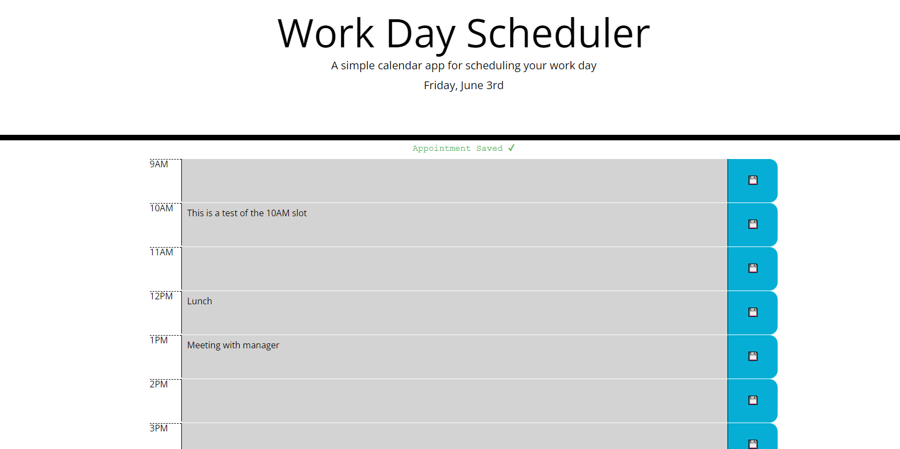

# WorkDayScheduler

A workday planner. Users can click in any of the textboxes to add an appointment to the corresponding hour. Data is saved to localstorage. Time boxes are color coded based on whether they are in the past, present, or future.

See deployment [here](https://jareddaniel95.github.io/WorkDayScheduler/).